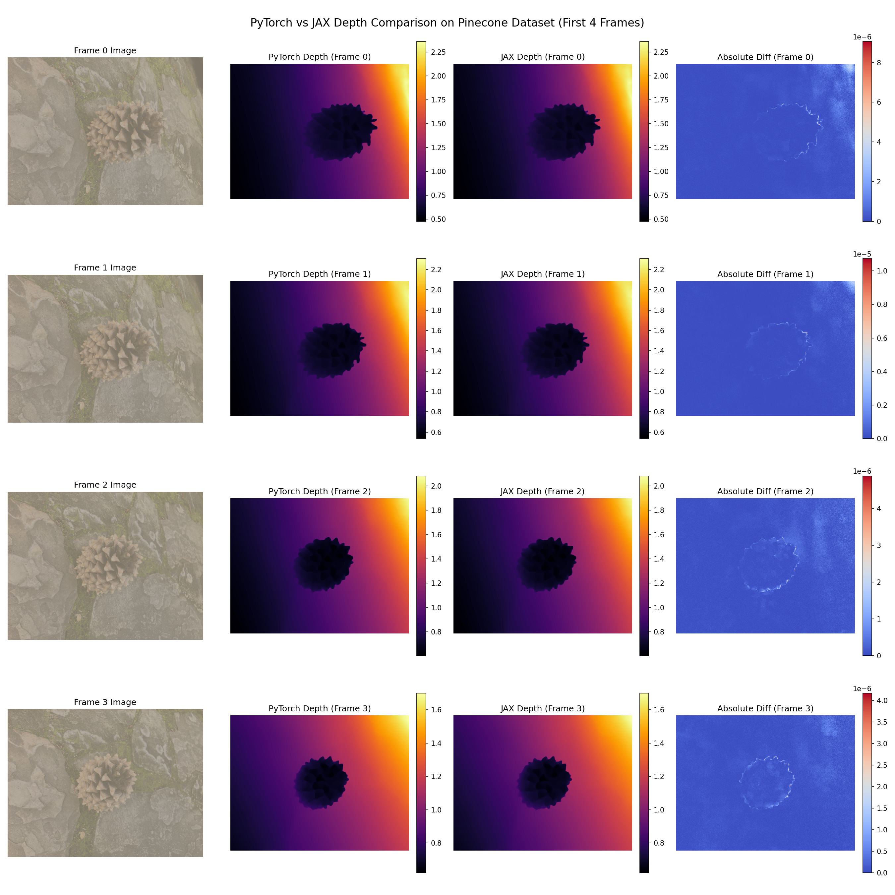
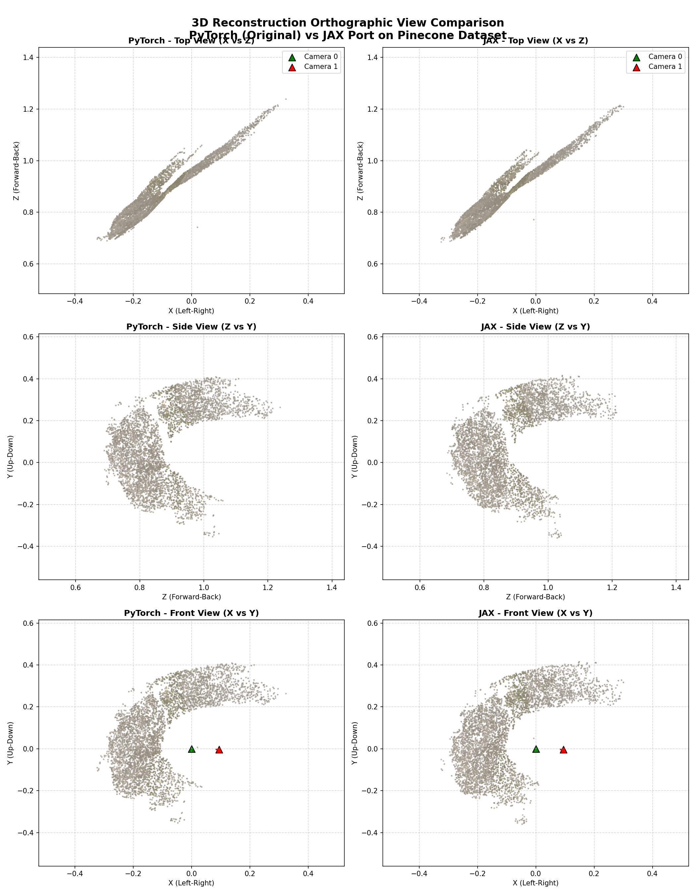

<div align="center">
<h1>VGGT-&Omega;</h1>

<a href="http://vggt-omega.github.io/" target="_blank" rel="noopener noreferrer"></a>
<a href="https://arxiv.org/abs/2605.15195" target="_blank" rel="noopener noreferrer"></a>
<a href="https://huggingface.co/spaces/facebook/vggt-omega"></a>

<p>
  <span class="author"><a href="https://jytime.github.io/">Jianyuan Wang</a><sup>1,2</sup></span>
  <span class="author"><a href="https://silent-chen.github.io/">Minghao Chen</a><sup>1</sup></span>
  <span class="author"><a href="https://scholar.google.com/citations?user=FUDsZkEAAAAJ&amp;hl=zh-CN">Shangzhan Zhang</a><sup>1</sup></span>
  <span class="author"><a href="https://nikitakaraevv.github.io/">Nikita Karaev</a><sup>1</sup></span>
  <br>
  <span class="author"><a href="https://demuc.de/">Johannes Schönberger</a><sup>2</sup></span>
  <span class="author"><a href="https://scholar.google.com/citations?user=IJidh-UAAAAJ&amp;hl=fr">Patrick Labatut</a><sup>2</sup></span>
  <span class="author"><a href="https://scholar.google.com/citations?user=lJ_oh2EAAAAJ&amp;hl=en">Piotr Bojanowski</a><sup>2</sup></span>
  <span class="author"><a href="https://d-novotny.github.io/">David Novotny</a></span>
  <br>
  <span class="author"><a href="https://www.robots.ox.ac.uk/~vedaldi/">Andrea Vedaldi</a><sup>1,2</sup></span>
  <span class="author"><a href="https://chrirupp.github.io/">Christian Rupprecht</a><sup>1</sup></span>
</p>

**<sup>1</sup>[Visual Geometry Group, University of Oxford](https://www.robots.ox.ac.uk/~vgg/)**; **<sup>2</sup>[Meta AI](https://ai.facebook.com/research/)**
</div>

## Pretrained models

Before using the models, please request access to the checkpoints [here](https://huggingface.co/facebook/VGGT-Omega). Once your request is approved, you can download the checkpoints. Please note that access requests are reviewed by an automated process based on the information provided in the request.

| Model | Resolution | Text alignment | Download |
| :--- | :--- | :--- | :--- |
| `VGGT-Omega-1B-512` | 512 | No | [Link](https://huggingface.co/facebook/VGGT-Omega/blob/main/vggt_omega_1b_512.pt) |
| `VGGT-Omega-1B-256-Text-Alignment` | 256 | Yes | [Link](https://huggingface.co/facebook/VGGT-Omega/blob/main/vggt_omega_1b_256_text.pt) |

The authors are not involved in the review process and cannot approve or reject individual applications. However, the [🤗 Hugging Face demo](https://huggingface.co/spaces/facebook/vggt-omega) is available to everyone.


## JAX / Flax Implementation

A complete JAX/Flax port of the model has been implemented and is located in the [vggt_omega/jax/](file:///home/kaiser/projects/vggt-omega-jax-webgpu/vggt_omega/jax/) directory.

### Converted Weights and RAM Configurations

To enable running the **1 Billion parameter model** on resource-constrained devices, three weights formats and precision setups are available:

1.  **Standard float32 Checkpoint (`vggt_omega_1b_512.msgpack.zst`)** (~4.36 GB):
    *   *Requirement:* ~18.4 GB peak RAM.
    *   *Usage:* Uses standard Flax initialization template and float32 parameters.
2.  **Low-RAM bfloat16 Checkpoint (`vggt_omega_1b_512_bf16.msgpack.zst`)** (~1.78 GB):
    *   *Requirement:* **<10 GB RAM** on CPU or GPU.
    *   *Optimization:* Bypasses JAX random template initialization (saves **~7.2 GB RAM**) by restoring msgpack weights directly. Uses `bfloat16` precision with dynamic JIT compilation.
3.  **Ultra-Low-RAM bfloat16 Memory-Mapped Checkpoint (`vggt_omega_1b_512_bf16_mmap/`)**:
    *   *Requirement:* **<4 GB RAM** (suitable for ultra-constrained edge devices).
    *   *Optimization:* Stored as a folder of recursive `.npy` parameters. Loads parameters on-the-fly from disk via NumPy `mmap_mode='r'` and discards them eager-layer-by-layer. This reduces weights physical RAM footprint to **0 MB**. Runs in JAX eager mode (no-JIT).

All JAX checkpoints are hosted publicly on Hugging Face:
*   **Hugging Face Dataset Repo:** [1kaiser/vggt-omega-jax](https://huggingface.co/datasets/1kaiser/vggt-omega-jax)
*   **JAX BF16 Checkpoint:** [Download](https://huggingface.co/datasets/1kaiser/vggt-omega-jax/resolve/main/vggt_omega_1b_512_bf16.msgpack.zst)
*   **JAX FP16 Checkpoint:** [Download](https://huggingface.co/datasets/1kaiser/vggt-omega-jax/resolve/main/vggt_omega_1b_512_fp16.msgpack.zst)

### Parity Verification

The JAX implementation's predictions match the PyTorch implementation's predictions with extremely high numerical precision. When evaluated on the `pinecone` dataset on CPU, the maximum absolute difference between PyTorch and JAX outputs is well below the `1e-3` parity threshold:

| Output Tensor | Shape | Max Absolute Difference | Mean Absolute Difference | Status |
| :--- | :--- | :--- | :--- | :--- |
| `camera_and_register_tokens` | `(1, 2, 17, 2048)` | `5.340576e-05` | `1.999295e-06` | PASSED |
| `pose_enc` | `(1, 2, 9)` | `1.192093e-07` | `3.231172e-08` | PASSED |
| `depth` | `(1, 2, 448, 592, 1)` | `9.059906e-06` | `5.387419e-07` | PASSED |
| `depth_conf` | `(1, 2, 448, 592)` | `3.252029e-04` | `2.490888e-05` | PASSED |

Below is the comparison plot displaying the input frames, the predicted depth maps from PyTorch and JAX, and their absolute error difference maps:



Below is the 3D reconstruction multiview comparison (Top, Side, and Front orthographic views) showing the point clouds and predicted camera positions/directions for both PyTorch and JAX implementations:



> [!NOTE]
> **Autocast and Precision**: The default PyTorch execution on GPU utilizes Automatic Mixed Precision (`autocast` in `float16`/`bfloat16`). In contrast, JAX defaults to `float32`. This can cause slight output variance when running PyTorch on GPU versus JAX on CPU. To achieve bit-wise mathematical parity, both models must be run in `float32` on the CPU, which aligns the accumulators and achieves the near-zero difference metrics listed above.

### Performance & Memory Comparison (CPU Benchmarks)

We benchmarked PyTorch vs JAX configurations on a sequence of 2 frames from the `pinecone` dataset (resized to 512x512) on CPU:

| Model / Implementation | Precision | Mode | Loading Time | Warm Inference | Peak RAM |
| :--- | :--- | :--- | :---: | :---: | :---: |
| **PyTorch CPU Baseline** | float32 | Eager | 8.76 s | 3.5232 s | 10086.9 MB |
| **JAX CPU Baseline** | float32 | JIT | 96.25 s | 17.4587 s | 18006.1 MB |
| **JAX CPU Low-RAM** | bfloat16 | JIT | 5.62 s | 17.6686 s | 11819.5 MB |
| **JAX CPU Ultra-Low-RAM** | bfloat16 | Eager (mmap) | **0.22 s** | 57.4138 s | **7574.2 MB** |

*Note: Since JAX CPU execution does not leverage parallel MKL/oneDNN optimization threads by default, JAX CPU inference is slower than PyTorch CPU. On GPU backends, JAX JIT compilation leverages XLA memory-fusion and kernel generation, resulting in significantly faster execution.*

### WebGPU & ONNX Web-Inference Compatibility

To assess compatibility with web-inference runners (e.g., **Transformers.js** / **ONNX Runtime Web WebGPU**):
*   We verified that the VGGT-Omega architecture is fully compatible with ONNX export formats using PyTorch's legacy TorchScript-based exporter (`dynamo=False` in `torch.onnx.export` to bypass dynamic control-flow tracing errors).
*   Exporting a static-shape configuration (e.g., input resolution `256` and `embed_dim=256` or `1024`) creates a standard, fully optimized `.onnx` graph containing all RoPE, pixel shuffle, and attention operations.
*   Because VGGT-Omega is a custom, non-standard Hugging Face architecture, it cannot be run with standard Transformers.js pipeline APIs (such as `pipeline()`) out-of-the-box. Instead, it must be loaded directly using the **ONNX Runtime Web** library (`ort.InferenceSession.create('model.onnx', { executionProviders: ['webgpu'] })`), with standard Javascript/WebGL preprocessing and postprocessing (similar to the workflow implemented in `skyseg_webgpu.html`).

### Running the Inference & Comparison Notebook

We use [Jupytext](https://jupytext.readthedocs.io/) and [Papermill](https://papermill.readthedocs.io/) for managing, generating, and running the notebooks cleanly.

To regenerate or run the comparison notebook:
1.  Initialize the notebook template from the Jupytext script:
    ```bash
    jupytext --to ipynb inference_comparison.py
    ```
2.  Execute the notebook using Papermill:
    ```bash
    papermill inference_comparison.ipynb executed_inference_comparison.ipynb --kernel num_gpu
    ```

A standalone JAX-only demo notebook is also available at [inference_demo_jax.ipynb](file:///home/kaiser/projects/vggt-omega-jax-webgpu/inference_demo_jax.ipynb).


## Quick Start

First, clone this repository and install the dependencies:

```bash
git clone git@github.com:facebookresearch/vggt-omega.git
cd vggt-omega
pip install -r requirements.txt
pip install -e .
```


Now, try the model with a few lines of code:

```python
import torch

from vggt_omega.models import VGGTOmega
from vggt_omega.utils.load_fn import load_and_preprocess_images
from vggt_omega.utils.pose_enc import encoding_to_camera

checkpoint_path = "path/to/vggt_omega_1b_512.pt"
image_names = ["path/to/imageA.png", "path/to/imageB.png", "path/to/imageC.png"]

model = VGGTOmega().to("cuda").eval()
model.load_state_dict(torch.load(checkpoint_path, map_location="cpu"))

images = load_and_preprocess_images(image_names, image_resolution=512).to("cuda")

with torch.inference_mode():
    predictions = model(images)

extrinsics, intrinsics = encoding_to_camera(
    predictions["pose_enc"],
    predictions["images"].shape[-2:],
)

depth = predictions["depth"]
depth_conf = predictions["depth_conf"]
camera_and_register_tokens = predictions["camera_and_register_tokens"]
camera_tokens = camera_and_register_tokens[:, :, :1]
registers = camera_and_register_tokens[:, :, 1:]
```

For the text-aligned checkpoint, use `VGGTOmega(enable_alignment=True)` with `image_resolution=256` and read `predictions["text_alignment_embedding"]`.


## Interactive Demo

Install the demo dependencies:

```bash
pip install -r requirements_demo.txt
```

Launch the Gradio demo with a local checkpoint path:

```bash
python demo_gradio.py \
  --checkpoint checkpoints/VGGT-Omega-1B-512/model.pt \
  --image-resolution 512
```

The demo accepts uploaded images or a video, runs camera and depth inference,
and visualizes the depth-unprojected point cloud and predicted cameras as a GLB
scene.

## Runtime and GPU Memory

We benchmark the end-to-end peak GPU memory usage of `VGGT-Omega-1B-512` on a
single NVIDIA A100 GPU with 624x416 input images. The measurement covers the full
inference program, from loading the model weights onto the GPU through the
forward pass, so it includes both the memory needed to store the model itself
and the memory used by inference activations and buffers. In other words, a GPU
with at least the listed available memory is able to run the corresponding
number of input frames under this setup.

| **Input Frames** | 1 | 10 | 25 | 50 | 100 | 200 | 300 | 400 | 500 |
|:----------------:|:-:|:--:|:--:|:--:|:---:|:---:|:---:|:---:|:---:|
| **Peak Memory (GB)** | 6.02 | 6.67 | 7.80 | 9.66 | 13.37 | 20.82 | 28.26 | 35.71 | 43.15 |

The benchmark uses [`load_and_preprocess_images`](./vggt_omega/utils/load_fn.py)
with the default `mode="balanced"` and `image_resolution=512`. For these roughly
3:2 landscape images, this produces 624x416 inputs. You can set
`mode="max_size"` to resize the longest side to 512 instead; for the same aspect
ratio, this gives about 512x336 inputs and uses less GPU memory.

## License

See the [LICENSE](./LICENSE) file for details about the license under which
this code is made available.

[^release]: This Release is intended to support the open source research community.

```bibtex
@misc{wang2026vggtomega,
      title={VGGT-$\Omega$}, 
      author={Jianyuan Wang and Minghao Chen and Shangzhan Zhang and Nikita Karaev and Johannes Schönberger and Patrick Labatut and Piotr Bojanowski and David Novotny and Andrea Vedaldi and Christian Rupprecht},
      year={2026},
      eprint={2605.15195},
      archivePrefix={arXiv},
      primaryClass={cs.CV},
      url={https://arxiv.org/abs/2605.15195}, 
}
```
